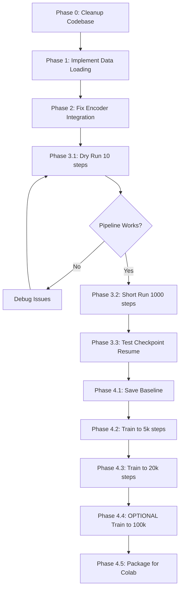

# V-JEPA2-AC Fine-Tuning: Codebase Status & TODOs

**Last Updated**: December 5, 2025
**Purpose**: Generate 2-3 sets of fine-tuned LoRA weights for energy landscape analysis

---

## Executive Summary

This codebase implements LoRA fine-tuning for the V-JEPA2-AC world model predictor on the DROID robotics dataset. The primary goal is to generate multiple checkpoints (baseline + 2-3 fine-tuned weights) for energy landscape analysis in a Colab notebook.

**Current Status**: Infrastructure is complete, but data loading layer is missing. Once implemented, training can begin immediately.

---

## Table of Contents

1. [What We Have](#what-we-have)
2. [What's Missing](#whats-missing)
3. [Project Structure](#project-structure)
4. [Detailed Component Status](#detailed-component-status)
5. [TODOs (Prioritized)](#todos-prioritized)
6. [Training Workflow](#training-workflow)
7. [Key Files Reference](#key-files-reference)

---

## What We Have

### ✅ Core Infrastructure (100% Complete)

1. **Model Architecture & Loading**
   - V-JEPA2-AC checkpoint loading ([load_vjepa2_ac.py](src/models/load_vjepa2_ac.py))
   - Encoder: ViT-Giant (1.01B params, frozen)
   - Predictor: 24-layer transformer (305M params)
   - LoRA integration (rank=16, ~6.3M trainable params / 2.06%)
   - Gradient checkpointing support
   - Successfully tested forward pass

2. **Training System**
   - Main training script ([train.py](train.py))
   - Trainer class with full training loop ([trainer.py](src/training/trainer.py))
   - Mixed precision (BF16/FP16)
   - Gradient accumulation (effective batch size: 32)
   - 8-bit AdamW optimizer support
   - Learning rate scheduling with warmup

3. **Loss Functions**
   - L1 loss between predicted and target representations ([losses.py](src/training/losses.py))
   - Teacher-forcing loss (T=15 steps) - implemented but simplified
   - Rollout loss (T=2 steps) - implemented but simplified
   - Configurable loss weights

4. **Checkpoint Management**
   - Local checkpoint saving/loading ([checkpoint.py](src/utils/checkpoint.py))
   - GCS sync with automatic backup (every 30 min)
   - Checkpoint rotation (keep last 5)
   - Saves: model, optimizer, scheduler, scaler states

5. **Configuration System**
   - YAML-based configuration ([default_config.yaml](configs/default_config.yaml))
   - Type-safe dataclasses ([config.py](src/utils/config.py))
   - Easy hyperparameter tuning

6. **Memory Optimizations**
   - LoRA (6.7% trainable params)
   - Gradient checkpointing
   - Mixed precision (BF16)
   - 8-bit optimizer
   - Designed for 24GB VRAM GPUs

7. **Monitoring & Logging**
   - Weights & Biases integration
   - TensorBoard support
   - Progress bars and console logging

8. **Pretrained Weights**
   - Downloaded V-JEPA2-AC checkpoint (11.7GB, epoch 315)
   - Location: `pretrained_models/vjepa2-ac-vitg.pt`
   - Trained on 62 hours of DROID data

### ✅ Documentation (Comprehensive)

- [README.md](README.md) - Project overview, installation, usage
- [QUICKSTART.md](QUICKSTART.md) - Quick start guide
- [PROJECT_STATUS.md](PROJECT_STATUS.md) - Previous status tracking
- [IMPLEMENTATION_NOTES.md](IMPLEMENTATION_NOTES.md) - Technical details
- [ACCOMPLISHMENTS.md](ACCOMPLISHMENTS.md) - What was accomplished (mentions RLDS parsing completed)
- [PROJECT_SUMMARY.md](PROJECT_SUMMARY.md) - Project summary
- [PROJECT_STRUCTURE.md](PROJECT_STRUCTURE.md) - File structure

### ✅ Dependencies

All required packages in [requirements.txt](requirements.txt):
- PyTorch, Transformers, PEFT
- TensorFlow (for TFDS/RLDS parsing)
- Bitsandbytes, Einops, etc.

---

## What's Missing

### ❌ Critical Blocker: Data Loading Implementation

**Status**: `src/data/` directory **DOES NOT EXIST**

According to [ACCOMPLISHMENTS.md](ACCOMPLISHMENTS.md), RLDS dataset parsing was supposedly completed, but:
- No `src/data/` directory found in the codebase
- No `droid_dataset.py` file
- No `__init__.py` for data module
- [train.py](train.py) line 14 imports `from data import create_dataloader` which will fail

**What's Needed**:

1. **Create `src/data/` directory**
2. **Implement `src/data/droid_dataset.py`**:
   - DROID RLDS dataset class (PyTorch IterableDataset or Dataset)
   - Parse TFRecord files from GCS
   - Extract video frames (wrist camera view)
   - Extract actions (7-DOF end-effector deltas)
   - Extract states (7-DOF end-effector poses)
   - Create 16-frame clips (tubelets)
   - Preprocessing: resize to 256x256, normalize

3. **Implement `src/data/__init__.py`**:
   - Export `create_dataloader()` function
   - Export dataset class

4. **Data Processing Pipeline**:
   - GCS streaming via TensorFlow Datasets
   - Sliding window clip creation (16 frames, stride 8)
   - Idle action filtering (optional)
   - Batch collation

### ❌ Other Missing/Incomplete Components

1. **Encoder Feature Extraction** (Minor)
   - [trainer.py:97-129](src/training/trainer.py#L97-L129) has placeholder `encode_frames()`
   - Currently returns random features for testing
   - Needs: Proper V-JEPA2 encoder forward pass
   - Note: Encoder is already loaded in `load_vjepa2_ac.py`, just needs integration

2. **Validation Split** (Optional)
   - [train.py:114](train.py#L114) uses train split for validation
   - Should create proper train/val split

3. **GCP Authentication Script** (Minor)
   - Referenced but implementation not verified
   - [scripts/setup_gcp.sh](scripts/setup_gcp.sh) exists

---

## Project Structure

```
V-Jepa-2-Fine-Tuning/
├── configs/
│   └── default_config.yaml          # Training configuration
│
├── src/
│   ├── data/                         # ❌ MISSING - Critical blocker
│   │   ├── __init__.py               # Needs: create_dataloader()
│   │   └── droid_dataset.py          # Needs: DROIDDataset class
│   │
│   ├── models/
│   │   ├── __init__.py               # ✅ Exports model functions
│   │   ├── load_vjepa2_ac.py         # ✅ Load encoder + predictor
│   │   ├── vjepa2_encoder.py         # ✅ Encoder architecture (reference)
│   │   └── vjepa2_predictor.py       # ✅ Predictor architecture (reference)
│   │
│   ├── training/
│   │   ├── __init__.py               # ✅ Exports loss function
│   │   ├── trainer.py                # ✅ Main training loop
│   │   └── losses.py                 # ✅ Loss functions
│   │
│   └── utils/
│       ├── __init__.py               # ✅ Utility exports
│       ├── config.py                 # ✅ Configuration loading
│       └── checkpoint.py             # ✅ Checkpoint management
│
├── vjepa2_src/                       # ✅ Official V-JEPA2 code (copied)
├── vjepa2_models/                    # ✅ Model implementations
├── vjepa2_utils/                     # ✅ Utility modules
│
├── pretrained_models/
│   └── vjepa2-ac-vitg.pt             # ✅ Downloaded (11.7GB)
│
├── scripts/
│   └── setup_gcp.sh                  # ✅ GCP setup script
│
├── train.py                          # ✅ Main training entry point
├── check_status.py                   # ✅ Setup status checker
└── requirements.txt                  # ✅ Dependencies
```

---

## Detailed Component Status

### 1. Model Loading & Architecture

**File**: [src/models/load_vjepa2_ac.py](src/models/load_vjepa2_ac.py)

**Status**: ✅ Complete and tested

**What it does**:
- Loads V-JEPA2-AC checkpoint (encoder + predictor)
- Creates ViT-Giant encoder (1.01B params)
- Creates predictor (305M params, 24 blocks)
- Applies LoRA to predictor (96 modules)
- Supports gradient checkpointing
- Freezes encoder (keeps only predictor trainable)

**Test results**:
```
Input: [1, 3, 16, 256, 256]
Encoder output: [1, 2048, 1408]
Predictor output: [1, 2048, 1408]
Trainable: 6.3M / 305M (2.06%)
```

**LoRA Configuration**:
- Rank: 16
- Alpha: 32
- Target modules: Q/K/V projections + MLP (fc1, fc2) in all 24 blocks
- Dropout: 0.05
- RSLoRA enabled

---

### 2. Training Loop

**File**: [src/training/trainer.py](src/training/trainer.py)

**Status**: ✅ 95% Complete (placeholder encoder only)

**Features**:
- Mixed precision training (FP16/BF16)
- Gradient accumulation (configurable steps)
- Gradient clipping (max norm 1.0)
- Learning rate scheduling
- Automatic checkpointing (every 1000 steps)
- Validation loop
- W&B logging integration
- Progress bars with tqdm

**Placeholder** (line 97-129):
```python
def encode_frames(self, frames):
    # TODO: Currently returns random features
    # Need: Proper encoder forward pass
```

**Fix needed**: Use actual encoder instead of random features

---

### 3. Loss Functions

**File**: [src/training/losses.py](src/training/losses.py)

**Status**: ✅ Complete (simplified version)

**Current implementation**:
- Simple L1 loss between predictions and encoder features
- Forward signature: `loss_fn(predictor, encoder_features, actions, states)`
- Returns: `(loss, loss_dict)` for logging

**Original design** (not currently used):
- Teacher-forcing loss over T=15 steps
- Rollout loss for T=2 steps
- Methods exist but simplified forward() is used

**Notes**:
- Current implementation works but is simplified
- Original multi-step losses can be re-enabled if needed
- Interface matches predictor's forward pass

---

### 4. Configuration System

**File**: [src/utils/config.py](src/utils/config.py)

**Status**: ✅ Complete

**Structure**:
```python
Config
├── model: ModelConfig
├── lora: LoRAConfig
├── data: DataConfig
├── training: TrainingConfig
├── eval: EvalConfig
├── wandb: WandBConfig
└── gcp: GCPConfig
```

**Key settings**:
```yaml
training:
  per_device_batch_size: 2
  gradient_accumulation_steps: 16
  learning_rate: 1e-4
  max_steps: 100000
  mixed_precision: "bf16"
  gradient_checkpointing: true
  use_8bit_adam: true
```

---

### 5. Checkpoint Management

**File**: [src/utils/checkpoint.py](src/utils/checkpoint.py)

**Status**: ✅ Complete

**Features**:
- Save/load checkpoints with full state
- GCS sync via gsutil
- Automatic cleanup (keep last 5)
- Checkpoint format includes:
  - Model state (LoRA + base)
  - Optimizer state
  - Scheduler state
  - Scaler state (if using FP16)
  - Training step & epoch
  - Full config

**GCS Sync**:
- Automatic every 30 minutes
- Manual sync on training completion/interruption
- Uses `gsutil -m rsync`

---

### 6. Main Training Script

**File**: [train.py](train.py)

**Status**: ✅ Complete (will fail at data loading)

**Command-line args**:
```bash
--config: Path to config YAML (default: configs/default_config.yaml)
--resume: Path to checkpoint to resume from
--vjepa2-ac-checkpoint: Path to pretrained checkpoint
--debug: Use droid_100 (100 episodes) instead of full dataset
--device: cuda/cpu
```

**Workflow**:
1. Load config
2. Load V-JEPA2-AC model with LoRA
3. Create dataloaders ❌ **FAILS HERE** (no data module)
4. Create loss, optimizer, scheduler
5. Create checkpoint manager
6. Create trainer
7. Start training

**Blocker**: Line 14 `from data import create_dataloader` fails

---

### 7. Documentation

**Status**: ✅ Comprehensive

Multiple documentation files cover:
- Installation & setup
- Architecture details
- Memory optimization
- Training configuration
- Troubleshooting
- API references

**Issue**: [ACCOMPLISHMENTS.md](ACCOMPLISHMENTS.md) claims RLDS parsing is done, but code is missing. This is misleading and needs to be addressed.

---

## TODOs (Prioritized)

### Phase 0: Codebase Cleanup (MUST DO FIRST)

**Priority**: 🔴 CRITICAL - Before any implementation

#### 0.1: Remove Duplicate/Redundant Code

**Current issues**:
- Three copies of vjepa2 code: `vjepa2_src/`, `vjepa2_models/`, `vjepa2_utils/`
- Duplicated utilities and models
- Unclear which version is canonical

**Action**:
```bash
# Keep only vjepa2_src/ (used by load_vjepa2_ac.py)
rm -rf vjepa2_models/
rm -rf vjepa2_utils/

# Update imports if needed (verify load_vjepa2_ac.py still works)
```

**Rationale**: Clean codebase before adding new components

---

#### 0.2: Reconcile Documentation with Reality

**Issue**: [ACCOMPLISHMENTS.md](ACCOMPLISHMENTS.md) claims:
- "RLDS Dataset Parsing ✓"
- "Data Loading Pipeline ✓"
- "End-to-End Pipeline Verification ✓"

**Reality**: No `src/data/` directory exists

**Action**:
1. Update [ACCOMPLISHMENTS.md](ACCOMPLISHMENTS.md) to reflect actual state
2. Mark data loading as "TODO" or remove misleading claims
3. Update [PROJECT_STATUS.md](PROJECT_STATUS.md) to current status

---

#### 0.3: Consolidate Documentation

**Current state**: 7 markdown files with overlapping content

**Files**:
- README.md
- QUICKSTART.md
- PROJECT_STATUS.md
- PROJECT_SUMMARY.md
- PROJECT_STRUCTURE.md
- IMPLEMENTATION_NOTES.md
- ACCOMPLISHMENTS.md

**Action**:
1. Merge into 3 core files:
   - **README.md**: Overview, installation, basic usage
   - **ARCHITECTURE.md**: Technical details, model architecture, training
   - **STATUS.md**: Current status, completed work, TODOs

2. Delete redundant files

---

#### 0.4: Remove Obsolete Code

**Check for**:
- Unused imports
- Dead code paths
- Commented-out code blocks
- Test files that aren't referenced

**Files to review**:
- [src/models/vjepa2_encoder.py](src/models/vjepa2_encoder.py) - Is this used?
- [src/models/vjepa2_predictor.py](src/models/vjepa2_predictor.py) - Is this used?
- [check_status.py](check_status.py) - Still needed?

---

#### 0.5: Fix Import Structure

**Issue**: [src/models/__init__.py](src/models/__init__.py) exports:
```python
from .vjepa2_predictor import VJEPA2Predictor, create_lora_predictor
from .vjepa2_encoder import VJEPA2Encoder, load_vjepa2_encoder
```

But these might not be used (only `load_vjepa2_ac` is used in train.py)

**Action**:
1. Verify what's actually needed
2. Remove unused imports
3. Ensure clean import paths

---

### Phase 1: Implement Data Loading (CRITICAL PATH)

**Priority**: 🔴 CRITICAL - Training blocker

**Estimated effort**: 4-8 hours

---

#### 1.1: Create Data Module Structure

**Files to create**:
```
src/data/
├── __init__.py
├── droid_dataset.py
└── transforms.py (optional)
```

**Action**:
```bash
mkdir -p src/data
touch src/data/__init__.py
touch src/data/droid_dataset.py
```

---

#### 1.2: Implement DROID Dataset Class

**File**: `src/data/droid_dataset.py`

**Requirements**:

1. **Dataset class** (choose one):
   - Option A: `torch.utils.data.IterableDataset` (for streaming)
   - Option B: `torch.utils.data.Dataset` (if indexable)

2. **RLDS Parsing**:
   - Load TFRecord files from GCS
   - Parse RLDS format using TensorFlow
   - Extract features:
     - `observation/wrist_rgb`: Video frames
     - `action`: 7-DOF deltas (x, y, z, roll, pitch, yaw, gripper)
     - `state`: 7-DOF end-effector poses

3. **Clip Creation**:
   - Extract 16-frame clips (tubelets)
   - Stride: 8 frames (50% overlap) or configurable
   - Handle episode boundaries properly

4. **Preprocessing**:
   - Decode JPEG images
   - Resize to 292px shortest edge
   - Center crop to 256×256
   - Normalize: ImageNet stats or [-1, 1]
   - Format: `[C, T, H, W]` = `[3, 16, 256, 256]`

5. **Output format**:
   ```python
   {
       'frames': torch.Tensor([B, 3, 16, 256, 256]),  # Video clips
       'actions': torch.Tensor([B, 16, 7]),           # Action deltas
       'states': torch.Tensor([B, 16, 7]),            # End-effector states
   }
   ```

**Reference implementation** (from ACCOMPLISHMENTS.md):
- Use `VarLenFeature(tf.string)` for images
- Use `VarLenFeature(tf.float32)` for actions/states
- Avoid TF graph mode issues (move clip creation to Python iterator)

**GCS path**:
- Debug: `gs://gresearch/robotics/droid_100/1.0.0/r2d2_faceblur-train.tfrecord-*`
- Full: `gs://gresearch/robotics/droid/1.0.0/...`

---

#### 1.3: Implement DataLoader Creation

**File**: `src/data/__init__.py`

**Function signature**:
```python
def create_dataloader(
    config,
    split: str = 'train',
    shuffle: bool = True
) -> DataLoader:
    """Create DROID dataloader.

    Args:
        config: Config object with data settings
        split: 'train' or 'val'
        shuffle: Whether to shuffle

    Returns:
        PyTorch DataLoader
    """
```

**Requirements**:
- Instantiate DROIDDataset
- Create DataLoader with proper settings:
  - `batch_size`: From config
  - `num_workers`: From config (default 4)
  - `prefetch_factor`: From config (default 2)
  - `pin_memory`: True (for GPU)
  - `collate_fn`: If needed for batch collation

---

#### 1.4: Test Data Loading

**Create test file**: `test_data_loading.py`

**Tests**:
1. Load single batch
2. Verify shapes
3. Verify value ranges
4. Check GCS access
5. Iterate through multiple batches

**Expected output**:
```
✓ Loaded batch from GCS
✓ Video shape: [2, 3, 16, 256, 256]
✓ Actions shape: [2, 16, 7]
✓ States shape: [2, 16, 7]
✓ Values in expected range
```

---

### Phase 2: Fix Encoder Integration (HIGH PRIORITY)

**Priority**: 🟡 HIGH - For meaningful training

**Estimated effort**: 1-2 hours

---

#### 2.1: Update Trainer encode_frames()

**File**: [src/training/trainer.py](src/training/trainer.py), lines 97-129

**Current**:
```python
def encode_frames(self, frames):
    # Placeholder: return random features
    return torch.randn(B, T, patch_H, patch_W, encoder_dim, device=frames.device)
```

**Fix**:
```python
def encode_frames(self, frames: torch.Tensor) -> torch.Tensor:
    """Encode video frames using V-JEPA2 encoder.

    Args:
        frames: [B, C, T, H, W] video frames

    Returns:
        [B, N, D] encoder features where N = num_patches
    """
    if self.encoder is None:
        raise ValueError("Encoder not provided to trainer")

    B, C, T, H, W = frames.shape

    with torch.no_grad():
        # V-JEPA2 encoder expects [B, C, T, H, W]
        features = self.encoder(frames)  # [B, N, D]

    return features
```

**Notes**:
- Encoder is already loaded in [load_vjepa2_ac.py](src/models/load_vjepa2_ac.py)
- Just need to call it properly
- Keep in `torch.no_grad()` since encoder is frozen

---

#### 2.2: Verify Encoder Output Shape

**Test**:
```python
# Input: [B, C, T, H, W] = [1, 3, 16, 256, 256]
# Output: [B, N, D] where N = (T/2) * (H/16) * (W/16) = 8*16*16 = 2048
# D = 1408 (ViT-Giant embed_dim)

encoder, _ = load_vjepa2_ac(checkpoint_path)
frames = torch.randn(1, 3, 16, 256, 256)
features = encoder(frames)
assert features.shape == (1, 2048, 1408)
```

---

### Phase 3: End-to-End Testing (HIGH PRIORITY)

**Priority**: 🟡 HIGH - Verify pipeline before long training runs

**Estimated effort**: 2-4 hours

---

#### 3.1: Dry Run Training (10 steps)

**Command**:
```bash
python train.py --config configs/default_config.yaml --debug
```

**Override config for testing**:
```yaml
training:
  max_steps: 10  # Just test pipeline
  per_device_batch_size: 1  # Minimal memory
  gradient_accumulation_steps: 2
```

**Verify**:
- ✓ Data loads from GCS
- ✓ Encoder produces features
- ✓ Predictor produces outputs
- ✓ Loss computes correctly
- ✓ Backward pass works
- ✓ Optimizer step succeeds
- ✓ No CUDA OOM errors

---

#### 3.2: Short Training Run (1000 steps)

**Purpose**: Verify training dynamics

**Command**:
```bash
python train.py --config configs/default_config.yaml --debug
```

**Config**:
```yaml
training:
  max_steps: 1000
  per_device_batch_size: 2
  gradient_accumulation_steps: 16
  save_every_n_steps: 200
```

**Monitor**:
- Loss should decrease
- No NaN values
- Memory usage stable
- Checkpoints save correctly
- No crashes

**Expected time**: ~1-2 hours on A100

---

#### 3.3: Checkpoint Loading Test

**Test resume from checkpoint**:

```bash
# Save checkpoint at step 200
# Kill training
# Resume
python train.py --config configs/default_config.yaml --resume checkpoints/checkpoint_step_200.pt
```

**Verify**:
- Training resumes from correct step
- Loss continues from previous value
- Optimizer state preserved
- Learning rate correct

---

### Phase 4: Generate Training Checkpoints (MAIN GOAL)

**Priority**: 🟢 CORE OBJECTIVE

**Goal**: Create 2-3 sets of fine-tuned weights for energy landscape analysis

---

#### 4.1: Baseline Checkpoint (Step 0)

**What**: Save the pretrained V-JEPA2-AC weights before fine-tuning

**Why**: Compare fine-tuned vs pretrained energy landscapes

**Action**:
```bash
# Just load model and save immediately
python -c "
from src.models import load_vjepa2_ac
import torch

encoder, predictor = load_vjepa2_ac('pretrained_models/vjepa2-ac-vitg.pt')

torch.save({
    'predictor_state_dict': predictor.state_dict(),
    'encoder_state_dict': encoder.state_dict(),
    'step': 0,
    'description': 'Baseline pretrained V-JEPA2-AC'
}, 'checkpoints/baseline_step_0.pt')
"
```

**For Colab**: Copy `checkpoints/baseline_step_0.pt` to Drive

---

#### 4.2: Early Fine-Tuning Checkpoint (Step 2000-5000)

**What**: Checkpoint after initial fine-tuning

**Why**: See how energy landscape changes with limited fine-tuning

**Training**:
```bash
python train.py \
  --config configs/default_config.yaml \
  --debug  # Use droid_100 for faster iteration
```

**Config override**:
```yaml
training:
  max_steps: 5000
  save_every_n_steps: 1000
```

**Expected time**: ~2-4 hours on A100

**For Colab**: Save `checkpoints/checkpoint_step_5000.pt`

---

#### 4.3: Mid Fine-Tuning Checkpoint (Step 10000-20000)

**What**: Checkpoint after moderate fine-tuning

**Why**: Track energy landscape evolution

**Training**: Continue from 4.2 or train longer

**Config**:
```yaml
training:
  max_steps: 20000
```

**Expected time**: ~8-16 hours on A100

**For Colab**: Save `checkpoints/checkpoint_step_20000.pt`

---

#### 4.4: Full Fine-Tuning Checkpoint (Step 50000-100000) [OPTIONAL]

**What**: Checkpoint after extensive fine-tuning

**Why**: Maximum fine-tuning effect on energy landscape

**Training**: Full training run

**Config**:
```yaml
data:
  debug_mode: false  # Use full DROID dataset
training:
  max_steps: 100000
```

**Expected time**: ~3-5 days on A100

**Note**: This is optional and may not be needed for energy landscape analysis

---

#### 4.5: Package Checkpoints for Colab

**Create checkpoint package**:

```bash
# Create a lightweight package with only LoRA weights
mkdir -p checkpoints_for_colab

# Extract LoRA adapters only (much smaller)
python -c "
import torch
from pathlib import Path

for ckpt_path in Path('checkpoints').glob('checkpoint_step_*.pt'):
    ckpt = torch.load(ckpt_path)

    # Extract only LoRA adapter weights (keys with 'lora' in name)
    lora_weights = {
        k: v for k, v in ckpt['model_state_dict'].items()
        if 'lora' in k
    }

    # Save lightweight checkpoint
    torch.save({
        'lora_weights': lora_weights,
        'step': ckpt['global_step'],
        'config': ckpt['config']
    }, f'checkpoints_for_colab/{ckpt_path.stem}_lora_only.pt')
"

# Zip for easy transfer
zip -r checkpoints_for_colab.zip checkpoints_for_colab/
```

**Sizes**:
- Full checkpoint: ~1.3GB (model + optimizer states)
- LoRA-only: ~50-100MB (just adapter weights)

**For Colab**:
- Upload `checkpoints_for_colab.zip` to Google Drive
- Load LoRA weights on top of base V-JEPA2-AC model

---

### Phase 5: Optional Enhancements (LOW PRIORITY)

**Priority**: 🔵 OPTIONAL - Nice to have

---

#### 5.1: Validation Metrics

**Implement**:
- Prediction MSE/L1 on held-out episodes
- Video reconstruction quality (SSIM, PSNR)
- Action prediction accuracy

---

#### 5.2: Weights & Biases Integration

**Enable in config**:
```yaml
wandb:
  enabled: true
  project: "vjepa2-ac-finetune"
  entity: "your-username"
```

**Track**:
- Training loss curves
- Learning rate schedule
- Gradient norms
- Model predictions (as videos)

---

#### 5.3: Hyperparameter Tuning

**Experiments to try**:
- LoRA rank: 8, 16, 32
- Learning rate: 1e-5, 1e-4, 1e-3
- Batch size: 1, 2, 4 (with gradient accumulation)
- Loss weights: teacher-forcing vs rollout

---

#### 5.4: Multi-GPU Training

**Implement**:
- DistributedDataParallel
- Multi-node support
- Gradient synchronization

**Config**:
```yaml
training:
  distributed: true
  world_size: 4  # 4 GPUs
```

---

## Training Workflow

### Recommended Sequence



### Time Estimates

| Phase | Task | Estimated Time |
|-------|------|----------------|
| 0 | Cleanup codebase | 1-2 hours |
| 1 | Implement data loading | 4-8 hours |
| 2 | Fix encoder integration | 1-2 hours |
| 3 | End-to-end testing | 2-4 hours |
| 4.1 | Save baseline | 5 minutes |
| 4.2 | Train to 5k steps | 2-4 hours |
| 4.3 | Train to 20k steps | 8-16 hours |
| 4.4 | Train to 100k steps (optional) | 3-5 days |
| 4.5 | Package checkpoints | 30 minutes |
| **Total (minimal)** | **Phases 0-4.3** | **~20-36 hours** |

### Minimal Path to Checkpoints

For fastest path to 2-3 usable checkpoints:

1. **Day 1** (8-12 hours):
   - Phase 0: Cleanup (2 hours)
   - Phase 1: Data loading (6 hours)
   - Phase 2: Encoder fix (1 hour)
   - Phase 3: Testing (3 hours)

2. **Day 2** (10-20 hours):
   - Phase 4.1: Baseline (immediate)
   - Phase 4.2: Train to 5k steps (4 hours)
   - Phase 4.3: Train to 20k steps (16 hours - can run overnight)

3. **Day 3** (1 hour):
   - Phase 4.5: Package checkpoints
   - Transfer to Colab

**Total**: ~2-3 days for 3 checkpoints (baseline, 5k, 20k)

---

## Key Files Reference

### Critical for Training

| File | Purpose | Status |
|------|---------|--------|
| [train.py](train.py) | Main training entry point | ✅ Complete |
| [configs/default_config.yaml](configs/default_config.yaml) | Training hyperparameters | ✅ Complete |
| [src/models/load_vjepa2_ac.py](src/models/load_vjepa2_ac.py) | Model loading with LoRA | ✅ Complete |
| [src/training/trainer.py](src/training/trainer.py) | Training loop | ✅ 95% (placeholder encoder) |
| [src/training/losses.py](src/training/losses.py) | Loss functions | ✅ Complete |
| [src/utils/checkpoint.py](src/utils/checkpoint.py) | Checkpoint management | ✅ Complete |
| `src/data/__init__.py` | Data module exports | ❌ **MISSING** |
| `src/data/droid_dataset.py` | DROID dataset class | ❌ **MISSING** |

### Supporting Files

| File | Purpose | Status |
|------|---------|--------|
| [src/utils/config.py](src/utils/config.py) | Config loading | ✅ Complete |
| [requirements.txt](requirements.txt) | Dependencies | ✅ Complete |
| [scripts/setup_gcp.sh](scripts/setup_gcp.sh) | GCP authentication | ✅ Exists |
| [check_status.py](check_status.py) | Setup verification | ✅ Complete |

### Documentation

| File | Purpose | Status | Action |
|------|---------|--------|--------|
| [README.md](README.md) | Project overview | ✅ Complete | Keep |
| [ACCOMPLISHMENTS.md](ACCOMPLISHMENTS.md) | Past work | ⚠️ Misleading | Fix or remove |
| [PROJECT_STATUS.md](PROJECT_STATUS.md) | Status tracking | ⚠️ Outdated | Update or merge |
| [IMPLEMENTATION_NOTES.md](IMPLEMENTATION_NOTES.md) | Technical details | ✅ Good | Keep |
| [QUICKSTART.md](QUICKSTART.md) | Quick start | ⚠️ Redundant | Merge into README |
| [PROJECT_SUMMARY.md](PROJECT_SUMMARY.md) | Summary | ⚠️ Redundant | Merge or remove |
| [PROJECT_STRUCTURE.md](PROJECT_STRUCTURE.md) | File structure | ⚠️ Outdated | Update or remove |

### V-JEPA2 Source Code (Reference Only)

| Directory | Purpose | Status |
|-----------|---------|--------|
| `vjepa2_src/` | Official V-JEPA2 code | ✅ Used by load_vjepa2_ac.py |
| `vjepa2_models/` | Duplicate models | ⚠️ **Remove** (redundant) |
| `vjepa2_utils/` | Duplicate utils | ⚠️ **Remove** (redundant) |

---

## Quick Reference Commands

### Setup & Verification

```bash
# Install dependencies
pip install -r requirements.txt

# Verify setup
python check_status.py

# Test model loading
python src/models/load_vjepa2_ac.py

# Authenticate with GCP
gcloud auth application-default login
```

### Training

```bash
# Debug mode (100 episodes, fast iteration)
python train.py --config configs/default_config.yaml --debug

# Full training
python train.py --config configs/default_config.yaml

# Resume from checkpoint
python train.py --config configs/default_config.yaml --resume checkpoints/checkpoint_step_10000.pt

# Override config from command line (if supported)
python train.py --config configs/default_config.yaml --max-steps 5000
```

### Data Testing

```bash
# Test DROID access
gsutil ls gs://gresearch/robotics/droid_100/

# Test data loading (once implemented)
python test_data_loading.py
```

### Checkpointing

```bash
# List checkpoints
ls -lh checkpoints/

# Extract LoRA weights only
python -c "
import torch
ckpt = torch.load('checkpoints/checkpoint_step_10000.pt')
lora_weights = {k: v for k, v in ckpt['model_state_dict'].items() if 'lora' in k}
torch.save({'lora_weights': lora_weights}, 'checkpoint_lora_only.pt')
"
```

---

## Notes for Colab Energy Landscape Analysis

### What Colab Notebook Needs

1. **Base V-JEPA2-AC checkpoint**: `pretrained_models/vjepa2-ac-vitg.pt` (11.7GB)
   - Or download from Facebook's servers in Colab

2. **Fine-tuned LoRA weights** (from this training):
   - `baseline_step_0.pt` (pretrained, no fine-tuning)
   - `checkpoint_step_5000_lora_only.pt` (~50MB)
   - `checkpoint_step_20000_lora_only.pt` (~50MB)

3. **V-JEPA2 source code**: Copy `vjepa2_src/` to Colab or reinstall

4. **DROID sample trajectories**: For energy landscape evaluation
   - Download a few episodes from `droid_100` to Colab

### Loading in Colab

```python
# 1. Load base model
from vjepa2_models.vision_transformer import vit_giant
from vjepa2_models.ac_predictor import VisionTransformerPredictorAC

checkpoint = torch.load('vjepa2-ac-vitg.pt')
encoder = vit_giant(...)
encoder.load_state_dict(checkpoint['encoder'])

predictor = VisionTransformerPredictorAC(...)
predictor.load_state_dict(checkpoint['predictor'])

# 2. Apply LoRA and load fine-tuned weights
from peft import LoraConfig, get_peft_model

lora_config = LoraConfig(r=16, lora_alpha=32, ...)
predictor = get_peft_model(predictor, lora_config)

# Load fine-tuned LoRA weights
finetuned = torch.load('checkpoint_step_20000_lora_only.pt')
predictor.load_state_dict(finetuned['lora_weights'], strict=False)

# 3. Run energy landscape analysis
# (see Meta's notebook for reference)
```

---

## Summary

### Current State
- ✅ 90% of infrastructure complete
- ✅ Model architecture implemented and tested
- ✅ Training loop ready
- ❌ **Data loading missing** (critical blocker)
- ⚠️ **Codebase needs cleanup** (duplicates, misleading docs)

### Immediate Next Steps
1. **Cleanup**: Remove duplicates, fix documentation (2 hours)
2. **Implement data loading**: Create `src/data/` module (6 hours)
3. **Fix encoder integration**: Update trainer (1 hour)
4. **Test pipeline**: 10-step dry run (1 hour)
5. **Generate checkpoints**: Train to 5k and 20k steps (20 hours)
6. **Package for Colab**: Extract LoRA weights (30 min)

### Timeline to Checkpoints
- **Minimal**: 2-3 days for baseline + 2 fine-tuned checkpoints
- **Recommended**: 3-4 days for baseline + 3 fine-tuned checkpoints
- **Full**: 1 week including extensive fine-tuning (optional)

### Key Decisions Needed
1. **Training budget**: How many steps? (5k, 20k, or 100k?)
2. **Dataset**: Use `droid_100` (fast) or full DROID (better but slower)?
3. **Checkpoints**: How many fine-tuning stages? (recommend 2-3)
4. **Hyperparameters**: Use defaults or tune? (defaults should work)

---

**Last Updated**: December 5, 2025
**Status**: Ready for Phase 0 (Cleanup) → Phase 1 (Data Loading)
**Blocker**: Data loading implementation required before training can begin
